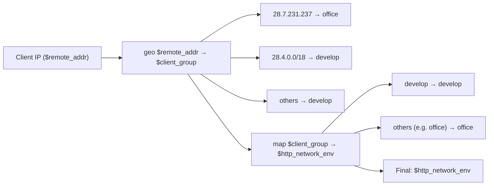

# Nginx Ingress 网络环境映射逻辑

## 配置片段
```nginx
http-snippet: |
  geo $remote_addr $client_group {
    default   "develop";
    28.7.231.237  "office";
    28.4.0.0/18   "develop";
  }

  map $client_group $http_network_env {
    default     "office";
    "develop"   "develop";
  }
```

## 配置逻辑解释

### 1. geo 指令
- 输入：客户端 IP (`$remote_addr`)
- 输出：新变量 `$client_group`
- 规则：
  - 28.7.231.237 → "office"
  - 28.4.0.0/18 → "develop"
  - 其他 IP → "develop" (default)

### 2. map 指令
- 输入：`$client_group`
- 输出：新变量 `$http_network_env`
- 规则：
  - "develop" → "develop"
  - 其他值（如 "office"）→ "office"

### 3. 最终效果
- IP = 28.7.231.237 → `$http_network_env=office`
- IP ∈ 28.4.0.0/18 → `$http_network_env=develop`
- 其他 IP → `$http_network_env=develop`

## 流程图

